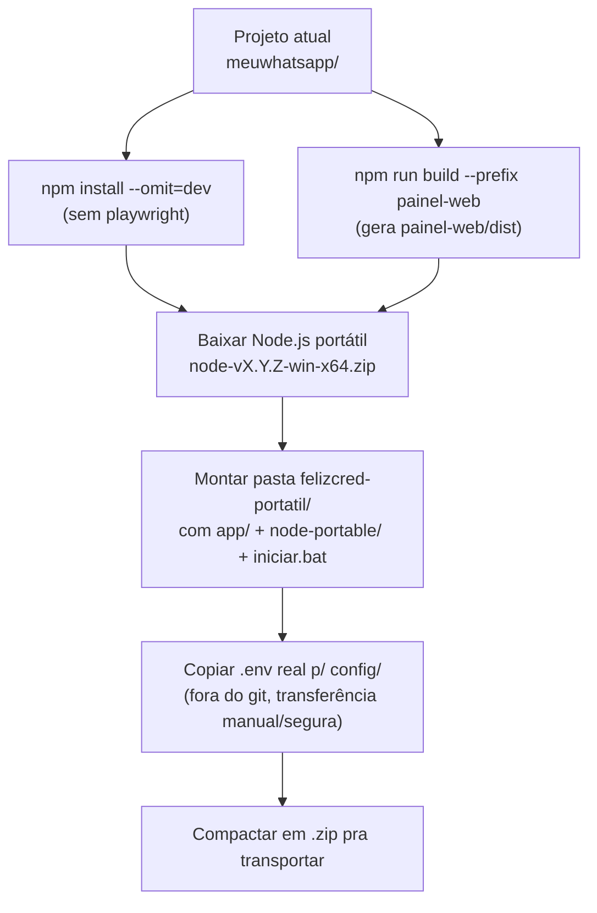
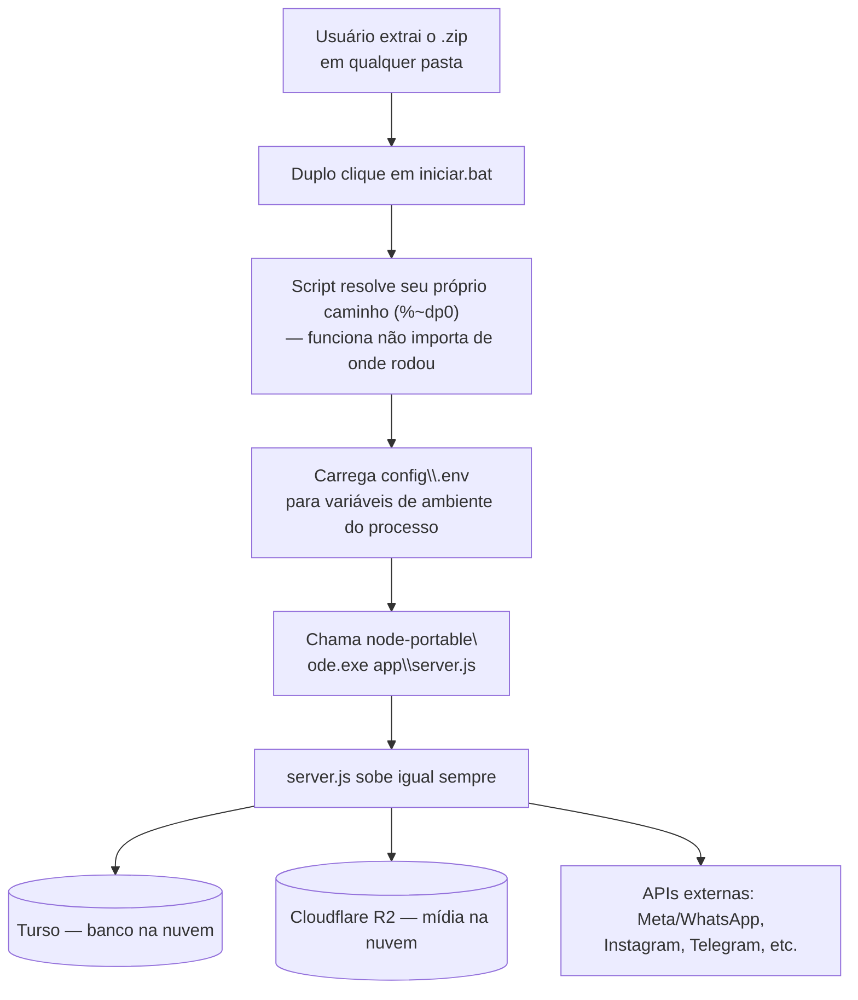

# Projeto: Tornar o programa portátil entre máquinas Windows

> **Status: planejamento, NÃO iniciado.** Este arquivo é o briefing completo —
> arquitetura, decisão e diagramas. A execução passo a passo fica em
> [`portabilidade-windows/runbook.md`](portabilidade-windows/runbook.md), feita
> pra ser seguida por uma IA (Claude Code) dentro deste projeto. Uma prova de
> conceito real já foi validada em
> [`portabilidade-windows/POC/`](portabilidade-windows/POC/).

## 1. Objetivo

Rodar este mesmo programa (o servidor Node em [server.js](server.js) + o
painel React em [painel-web/](painel-web/)) em qualquer máquina Windows
diferente, sem precisar instalar Node.js globalmente, sem `npm install` na
máquina de destino, e sem alterar nada do código atual.

## 2. Estado atual (por que isso já é mais simples do que parece)

Levantamento feito no código antes de decidir a arquitetura:

| Camada | Onde vive hoje | Implicação pra portabilidade |
|---|---|---|
| Banco de dados | Turso/libSQL na nuvem (`TURSO_DATABASE_URL` em [db.js](db.js)) — **não é arquivo local** | Nenhum dado pra sincronizar entre máquinas. O banco já é o mesmo em qualquer lugar que o programa rodar. |
| Arquivos/mídia | Cloudflare R2 ([r2.js](r2.js)) — ver [[feedback_render_disk_is_ephemeral]] | Mesma coisa: já não depende do disco local. |
| Configuração/segredos | `process.env.*` lido direto no código, sem `dotenv` instalado. Hoje setado no dashboard do Render. `.env` e `CHAVES-LOCAL.md` já estão no `.gitignore`. | Cada máquina vai precisar da própria fonte de variáveis de ambiente — não tem hoje um `.env` sendo carregado automaticamente. |
| Frontend (painel) | `painel-web/` — Vite + React + TypeScript, builda pra `painel-web/dist` (gitignored, gerado no deploy) | Precisa ser buildado uma vez e o resultado (`dist/`) copiado junto — não precisa buildar em cada máquina. |
| Dependência nativa | `@libsql/win32-x64-msvc` (binário `.node`) — **é a única dependência nativa do projeto**, e já é especificamente a versão Windows x64 | Como o alvo é sempre Windows, copiar `node_modules` como está já resolve — não tem recompilação nem multi-plataforma envolvida. |
| `playwright` | Só em `devDependencies`, não é `require`ado em nenhum `.js` do projeto | Não precisa ir pro pacote portátil (nem entra num `npm install --production`). |
| Scripts Python (`gerar_*.py`, `agendar_personas_cotacerta.py`) | Fora do programa Node, rodados manualmente | Fora do escopo deste pacote — ver seção 6 (limitações). |

Conclusão: o programa já é praticamente **stateless** — a única coisa que
realmente precisa "viajar" entre máquinas é o runtime do Node + o código +
`node_modules` + o `dist` do painel + as variáveis de ambiente. Não tem banco
local, não tem fila local, não tem cache em disco que importe.

## 3. As duas opções analisadas

### Opção 1 — Pacote portátil (código aberto + runtime embutido)

Copiar a pasta do projeto inteira (código + `node_modules` já instalados +
`painel-web/dist` já buildado) junto com uma cópia **portátil** do Node.js
para Windows (o zip oficial `node-vX.Y.Z-win-x64.zip`, que não instala nada,
não mexe no PATH, não precisa admin). Um `.bat` na raiz do pacote carrega as
variáveis de ambiente de um arquivo local e chama `.\node-portable\node.exe
server.js`.

**Prós:**
- Zero alteração de código. `server.js` continua rodando exatamente como
  hoje, só que a partir de outra pasta.
- Lida bem com a única dependência nativa (`@libsql/win32-x64-msvc`) — é só
  copiar o `node_modules`, já que o binário já é Windows x64.
- Fácil de depurar: é uma pasta normal, dá pra abrir os arquivos, editar,
  rodar `node server.js` direto se precisar.
- Fácil de atualizar: troca os arquivos `.js` alterados e pronto, sem
  reempacotar nada.

**Contras:**
- Não é um único arquivo `.exe` — é uma pasta (mas pode virar um `.zip` pra
  transportar).
- Código-fonte fica visível/copiável em texto puro (não é problema aqui —
  é um programa interno, não um produto sendo distribuído a terceiros).

### Opção 2 — Executável único (`pkg` / `nexe` / Node SEA)

Compilar `server.js` + dependências num único `.exe`.

**Prós:**
- Um arquivo só, mais "produto acabado".

**Contras (por isso foi descartada):**
- `server.js` tem 274 KB e usa `require("./...")` pra 14 módulos locais,
  todos resolvendo caminhos com `__dirname`/relativos (`public/`,
  `painel-web/dist`, `media/`, etc.). Ferramentas de executável único usam um
  filesystem virtual embutido — esse padrão de leitura de arquivo
  normalmente **precisa de ajuste no código** pra funcionar dentro do
  binário. Isso **quebra a restrição de não alterar código**.
- A dependência nativa `@libsql/win32-x64-msvc` (arquivo `.node`) é
  historicamente o tipo de coisa que quebra em `pkg`/`nexe` — precisa de
  configuração extra de "assets" pra embutir o binário certo.
- `@aws-sdk/client-s3` é uma dependência grande, aumenta bastante o binário
  final.
- `pkg` (da Vercel) está **sem manutenção** desde 2023 — risco de ficar preso
  numa versão antiga do Node. A alternativa nativa do Node (Single Executable
  Applications, Node 20+) é mais nova e tem suporte oficial, mas ainda tem
  suporte limitado a addons nativos e exige um passo de build (gerar
  "blob", injetar no binário) — mais uma peça a manter.
- Ganho real (clicar num `.exe` em vez de num `.bat`) é pequeno perto do
  risco/fragilidade, principalmente com a restrição de não tocar em código.

### Decisão

**Opção 1 — pacote portátil.** É a mais simples, não exige tocar em nenhum
código existente, e a arquitetura atual (banco e storage já na nuvem) já
elimina a parte mais difícil de qualquer solução portátil, que é sincronizar
dados.

## 4. Arquitetura da solução escolhida

### 4.1 Estrutura do pacote portátil

```
felizcred-portatil/                  ← pasta (ou .zip) que viaja entre máquinas
├── node-portable/                   ← Node.js Windows x64 (zip oficial, extraído)
│   └── node.exe
├── app/                             ← cópia do projeto atual
│   ├── server.js
│   ├── db.js
│   ├── whatsapp.js  instagram.js  ...  (todos os módulos atuais, sem alteração)
│   ├── node_modules/                ← já instalado (inclui @libsql/win32-x64-msvc)
│   ├── painel-web/
│   │   └── dist/                    ← build já pronto do painel (gerado 1x)
│   └── public/  media/  assets/     ← estáticos que o server.js já serve
├── config/
│   └── .env                         ← variáveis de ambiente da máquina (nunca no git)
└── iniciar.bat                      ← launcher
```

### 4.2 Fluxo de preparo (uma vez, na máquina de origem)



### 4.3 Fluxo de execução (em qualquer máquina Windows de destino)



### 4.4 Por que isso não muda o comportamento do programa

`server.js` continua lendo `process.env.*` do jeito que já lê hoje — a única
diferença é *quem* popula essas variáveis antes de chamar `node.exe`: no
Render é o dashboard, no pacote portátil é o `iniciar.bat` lendo
`config/.env`. Nenhuma linha de `server.js`, `db.js` ou qualquer módulo
precisa mudar.

## 5. Segredos entre máquinas

- `config/.env` **nunca vai pro git** (mesma regra de sempre, ver
  [[feedback_secrets_and_readme]]).
- Cada máquina de destino recebe seu próprio `config/.env`, transferido fora
  do git (pendrive, gerenciador de senha, pasta privada de sync) — igual já
  se faz hoje com `CHAVES-LOCAL.md`.
- A lista de variáveis necessárias (pra montar o `.env`) é levantada direto
  do código (`process.env.NOME`) no runbook, não precisa manter uma lista
  separada que desatualiza.

## 6. Limitações conhecidas (fora do escopo deste pacote)

- **Scripts Python** (`gerar_persona_overlay.py` e afins) não fazem parte do
  programa Node e não são cobertos por este pacote — se um dia precisarem
  rodar em outra máquina, é um pacote Python separado (ex: `pip freeze` +
  Python portátil), não é a mesma solução.
- **`playwright`** é `devDependency` não usada em produção — fica de fora do
  pacote portátil de propósito.

## 7. Próximos passos

Ver [`portabilidade-windows/runbook.md`](portabilidade-windows/runbook.md)
para a execução passo a passo (feita por IA, dentro deste projeto, quando o
usuário decidir montar o pacote de verdade). A POC em
[`portabilidade-windows/POC/`](portabilidade-windows/POC/) já validou o
padrão central (launcher `.bat` resolvendo seu próprio caminho + carregando
`.env` local + rodando um processo Node) numa escala pequena.
